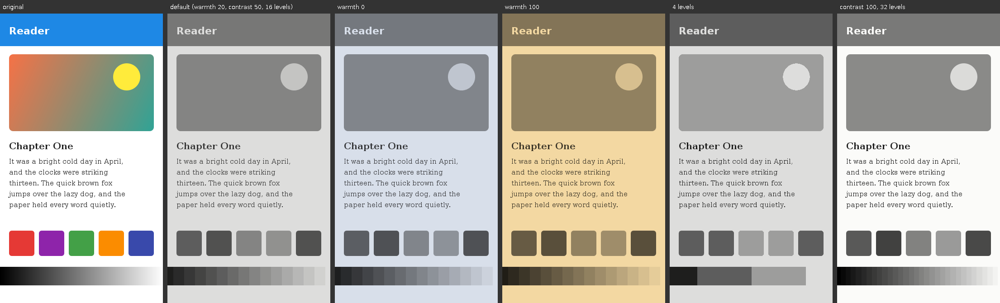

# PaperScreen

An Android app that makes an OLED phone feel like an e-ink reader. It rebuilds the screen from
per-window screenshots, runs each frame through an e-ink filter, and shows the result as a frozen, touch-transparent overlay
that only updates on a "page turn".



*Generated by running `EinkFilter` over a synthetic screen: original, default settings, warmth 0,
warmth 100, 4 grey levels, and contrast 100 with 32 levels.*

## How it works

```
SettingsActivity ──(start / stop)──▶ PaperScreenAccessibilityService
                                       (enabled in Settings → Accessibility)
                                                     │
     getWindows() ▶ takeScreenshotOfWindow() × N ────┤  WindowCapturer (worker thread)
                                                     │    composite over white ▶ EinkFilter ▶ Bitmap
                                                     ▼
                  OverlayWindow (TYPE_ACCESSIBILITY_OVERLAY, opaque, FLAG_NOT_TOUCHABLE)
```

The overlay is owned by an accessibility service because `TYPE_ACCESSIBILITY_OVERLAY` is the
one window type a regular app can draw that is **fully opaque and still passes touches
through**. Ordinary app overlays are capped at 80% opacity for touch pass-through since
Android 12.

The same service rebuilds the screen underneath from per-window screenshots.
`AccessibilityService.takeScreenshotOfWindow()` (Android 14+) records one window's own
layers. Unlike a whole-screen capture, it never includes the overlay, so the overlay stays
opaque the whole time.

Each refresh (`PaperScreenAccessibilityService.beginRefresh`):

1. **Capture, in the background.** The overlay keeps showing the current frame.
   `getWindows()` lists the visible windows (accessibility overlays excluded).
   `WindowCapturer` screenshots them one at a time and composites them bottom-up in layer
   order over plain white. The wallpaper isn't one of the reported windows, and the filter
   turns white into the paper colour. The composite is built on the GPU and read back once,
   then filtered.
2. **Diff.** `FrameDiff` compares the filtered frame with the one on screen and returns only
   the rows that changed, as bands from the leftmost to the rightmost changed pixel.
3. **Update**, as one of two kinds of refresh:
   - **Partial refresh** (usual): the changed bands are written into the frame on screen in
     place, and pixels that didn't change are never touched. With **Ghosting** on, what the
     changed regions showed before lingers faintly and fades out (opacity 5–60%, default 30%;
     fade 100–1000 ms, default 300 ms). That's the trail a real e-ink partial refresh
     leaves, and it makes the refreshed area visible. Without it, rewriting only the changed
     pixels looks identical to replacing the whole frame, since the unchanged pixels keep
     their values either way.
   - **Full refresh** (when on; every *N* partial refreshes, 10–100, default 50): the new
     frame is shown with inverted colours for the flash duration (150–600 ms, default
     350 ms), then normally. This mimics an e-ink page turn clearing its ghosts. The first
     frame after starting or rotating is a full refresh too. Unlocking is the exception (see
     *Lifecycle*): it's a partial refresh against the frame from before the screen went off.
     With full refresh off, every refresh is partial.

**No blank pages.** The overlay window is only on screen while it has a real frame to show.
Until the first valid capture after starting (or after a rotation, or a secure app), there's
no overlay at all, and you see the phone as it is. The overlay appears with its first frame
already in it. Every filtered frame is checked before it's used. A frame that comes out as a
single flat colour (every pixel within 4 grey levels) means the capture didn't really work,
for example every window failed or the GPU read back nothing. Such a frame is skipped, the
frame on screen stays, and the next cycle tries again. Skipped and failed captures are
logged: `adb logcat -s PaperScreen` shows lines like `capture skipped: the frame came out a
single colour (#E1E1DD)` or `capture skipped: no windows reported`. If no valid frame has
been shown within **5 seconds** of turning filtering on, it turns itself off again and a
toast says **"PaperScreen couldn't start — try again"**. The clock only runs while the
overlay is due: time with the screen off, locked, paused or in a secure app doesn't count.

Window screenshots cover the window's whole surface. The only position the API reports is
the bounds of the window's touchable region. `WindowPlacement` lines the two up: exact bounds
when the sizes match, full-screen windows at the origin, edge-anchored windows (status bar,
keyboard, navigation bar) to their edge, and everything else centred (dialog shadows).

**The 333 ms limit.** The system refuses a second screenshot of the same window within
333 ms. Different windows can be captured back to back, so windows are captured one at a
time and each waits out its own interval. In practice the fastest refresh is about every
340 ms.

**Refresh speed presets.** Standard (340 ms, the fastest Android allows, and the default),
Reading (500), Slow (1000), E-ink (1500), or Custom (340–2000 ms, in 20 ms steps). The
interval is the minimum time between refreshes. The choice is remembered.

**Settings layout.** The settings screen is styled as a page from the same book as the home
screen. It uses the home screen's paper and ink, tinted by the current warmth exactly as the
filter tints its output: background, text, hairlines, switches, sliders and dialogs. It also
uses the home screen's font (serif, sans-serif or monospace), and both update live as you
change them. There are no cards, shadows or coloured accents. Sections are separated by
hairlines and labelled with small, letterspaced headers:

- **Header:** the master switch, with a live one-line summary underneath, e.g.
  "Filtering active · Standard · 16 greys · Warmth 20".
- **Display:** Warmth, Contrast, and Posterization (with its grey levels).
- **Refresh:** speed presets, Refresh on change, Ghosting (opacity, fade) and Full refresh
  (interval, flash duration).
- **Night warmth** and **Home screen**, as described below.
- **Footer:** a full-width *Hold to preview* button, *About PaperScreen* (version and a
  *Support development* link, currently a placeholder URL in `strings.xml`), and *Reset all
  to defaults*. Reset asks first, then puts every setting on the page back to its default.
  It leaves alone your favourites, whether filtering is on, and whether PaperScreen is your
  home screen.

Each switch with sub-settings expands and collapses them with a short height animation, and
the whole page scrolls as one. Every slider shows its value and has a small circular-arrow
reset button. The arrow is light grey (and inactive) at the default, and darkens when there's
something to reset. Tapping it slides the value back to the default.

**Night warmth** (off by default). While on, warmth follows the time of day instead of the
Warmth slider: *Day warmth* (0–100, default 10) by day, *Night warmth* (0–100, default 60)
at night. With **Transition** on (the default), it shifts gradually over 30 minutes around
each changeover. The Warmth slider then shows the warmth in use right now, dimmed, with the
note "Controlled by Night warmth". Touching it offers to turn Night warmth off and go back to
manual warmth. The overlay re-checks the warmth every minute, and the home screen does too.
The schedule is one of:

- **Custom:** night from *Night starts* to *Night ends* (default 9 pm to 7 am). The
  transition is centred on each time, so warmth is halfway at 9 pm.
- **Sunrise/sunset:** apps can't get the location Android's Night Light uses without a
  location permission. So, if Night Light is itself set to *Sunset to sunrise*, PaperScreen
  follows its on/off state (a readable system setting). Only the switch itself is visible,
  so the transition starts when Night Light switches rather than being centred on sunset.
  Otherwise, sunrise and sunset are estimated with the NOAA formulae for the reference city
  of the phone's time zone (from the tz database's `zone1970.tab`, bundled as
  `assets/tz_coordinates.txt`). That's usually within a few minutes, but in a wide time zone
  it can be off by 30 minutes or more if you're far from that city. The settings screen shows
  which source is in use and the estimated times.

**Refresh on change.** With **Refresh only when the screen changes** on (the default),
refreshes are triggered by accessibility events that usually mean something visible changed:
content or window changes, scrolling, text edits, clicks and notifications. It still refreshes
at most once per interval. If refreshes keep finding nothing new, change-triggered refreshes
back off (up to one extra second) so a noisy app can't keep capturing.

### The filter (`EinkFilter`)

Every step depends only on luma, so the whole chain is folded into a 256-entry lookup table
and each pixel costs one table lookup:

| Step | Detail |
|---|---|
| Desaturate | Rec. 709 luma, fixed point |
| Posterize | 4–32 evenly spaced levels (default 16). With Posterization off, every grey is kept (smooth greyscale). |
| Contrast | Remaps 0/255 to ink/paper. Contrast 0 → 60/195, **50 (default) → 30/225**, 100 → 0/255 |
| Warmth | Per-channel tint from cool blue-grey (0) to sepia/amber (100). Default 20 |

A `ColorMatrix` can't express posterization, so the filter uses a lookup table, which is
exact and cheap on the CPU. The settings screen's **Hold to preview** (shown with the full-refresh inversion) runs the
same code over a `PixelCopy` snapshot of its own window.

### Lifecycle

- **On/off:** the master toggle starts and stops filtering. The choice is remembered, so
  filtering resumes by itself when the service reconnects (e.g. after a reboot). Turning the
  accessibility service off also turns filtering off. All settings are saved as you change
  them.
- **Notification:** while filtering is on, a regular (not foreground-service) notification
  offers **Stop** and **Pause 5 min**. It goes away when filtering stops. Pausing hides the
  overlay and brings it back after five minutes (sooner with **Resume**). Pausing again
  while paused doesn't extend it. If the
  phone sleeps through the end of the pause, it resumes on the next unlock. The pause is
  saved, so it survives the app's process being restarted. If Android has restarted the
  process and the service hasn't reconnected yet, the notification's buttons are recorded
  and applied as soon as it does. On Android 14 the user can swipe the notification away;
  filtering keeps running.
- **Screen off / locked:** capture pauses and the overlay window is removed (accessibility
  overlays would otherwise cover the lock screen). The last frame is kept. On unlock, a fresh
  overlay window shows that frame until the first capture updates it with a partial refresh.
- **Unlock grace period:** the lock screen and its unlock transition are `FLAG_SECURE`, so
  the first captures after unlocking would look like a secure app. For 1.5 seconds from
  whichever comes first of the screen turning on and the unlock, a capture that meets a
  secure window is dropped (the frame on screen is left alone) and retried 150 ms later,
  rather than treated as a secure app. No full refresh happens in that window either. One
  that's due waits for the next capture after it. If the grace period has already run out at
  unlock (for example, while a PIN was being typed), the unlock starts it again. A real
  secure app that's still open afterwards is handled as usual (see below). If a secure app
  was already up when the screen went off, the overlay stays away after unlocking until
  the secure app has gone, without repeating the notice.
- **Secure apps:** `FLAG_SECURE` windows (banking apps, password managers, some video apps)
  can't be captured. The system reports this with an error code, so there's no guessing
  from black pixels. When a capture meets one, it's dropped, and the overlay steps aside by
  itself, so the app shows normally (unfiltered). A small notice, **"Secure app detected —
  overlay paused"**, appears near the bottom of the screen for two seconds, in dark grey on
  the warmth-tinted paper colour with rounded corners. It's drawn by PaperScreen
  (`SecureNotice`, its own accessibility-overlay window), so it shows with the overlay
  gone. It's purely informational: it isn't touchable, and taps go straight to the app.
  While the secure app is up, PaperScreen checks about twice a second, and on every window
  change, whether any window is still secure. The window that was secure is tried first,
  and for it the answer comes back at once. Nothing is composited or shown. Once no window
  is secure (you switched to another app, or went home), the overlay comes back by itself
  with its first capture. That capture waits 500 ms, so the secure app's closing animation
  isn't caught in it, and it's a plain refresh, without the full-refresh flash. Until then
  the screen shows as it is. To turn filtering
  off for other reasons, there's still **Pause 5 min** in the notification.
  Resuming doesn't rely on the `ACTION_USER_PRESENT` broadcast alone: display-state changes
  and the accessibility events that follow an unlock also check "screen on, unlocked, should
  be filtering" and bring the overlay back.
- **Rotation / resolution change:** a `DisplayListener` notices, the stale frame is dropped
  and the overlay steps aside, and it comes back with a full refresh once the rotation
  animation is done.

## Home screen (optional launcher)

`HomeActivity` is a minimal home screen that reads like a page of a book: a white page and
serif text in `#333333`, both tinted by the filter's warmth setting so it matches filtered
screens. With filtering on, the filter discards colour and tints by brightness, so the
pre-tint isn't applied twice. It has two views.

**Home page** (the default), a single page that doesn't scroll (only the favourites do, if
they don't fit):

- **Clock** and **date** pinned to the top. The clock shows hours and minutes, without
  AM/PM, updated each minute (`ACTION_TIME_TICK`). With **Show seconds** on, it shows
  seconds too and ticks on each second boundary while visible. The date includes the day of
  the week and can be hidden. A hairline sits below them.
- **Favourites**: up to ten apps as a centred column of text labels, vertically centred in
  the space below the hairline. Two favourites sit in the middle of the page, not at the
  top. If all ten don't fit (a small screen, a large font), the list scrolls within that
  space, with faded edges, and the clock, date and "Search apps" stay put. Tap to open.
  **Long-press and drag** to reorder: the row follows your finger and the others slide apart
  (a RecyclerView with `ItemTouchHelper`, drawn without lift, shadow or scaling). The new
  order is saved on release. **Long-press and release** without moving for a small menu:
  **Remove from favourites**, **Move to top**, **Move to bottom** (a move that wouldn't
  change anything isn't offered). Favourites are added from the drawer. With none yet, a
  faint line says how. Saved across restarts.
- **Search apps**, a faint underlined line pinned to the bottom. Tapping it opens the drawer
  with the keyboard up.

**App drawer**, which replaces the home page while open:

- A **search field** at the top. It filters as you type, ignoring case and accents, and
  ranks prefix matches first, then word starts, then matches anywhere. **Go** on the
  keyboard opens the top result.
- The **app list**: every launchable app, names only, under bold letter headings (A, B, C…).
  Headings come from Android's ICU `AlphabeticIndex` for the phone's language (plus Latin
  A–Z), as in contacts apps. Accented names go under their base letter, other alphabets
  under their own letters, and Chinese or Japanese names under the index the language
  defines. Names starting with digits, symbols or emoji go under `#` at the end. While
  searching, the headings and index step aside for the ranked results.
- An **A–Z index** down the right edge, like a contacts app. Tap a letter, or slide along
  it, to jump to that section. Its letters shrink to fit when the keyboard is up.
- **Favourites** are marked with a small faint dot in the margin before the name (and
  "favourite" in the spoken description).
- **Long-press an app** for a menu: **Add to favourites** (only if it isn't one and there
  are fewer than ten; it's added at the end), **Remove from favourites** (only if it is
  one), and **App info** (Android's app info screen). The home page updates straight away.

Both long-press menus (`PaperMenu`) are a small list on the tinted page colour, with
hairlines between the rows, a hairline frame, and no shadow or animation. They appear just
below the pressed item (or above it near the bottom of the screen). A tap outside or Back
closes them.

Back or Home returns from the drawer to the home page, and leaving for an app resets it too.
On the home page, Back does nothing. The status bar and notification shade work as usual.
There's no wallpaper, widgets, dock, folders or icons. The app list updates itself as apps
are installed, updated or removed (`LauncherApps.Callback`).

**Setting it as the launcher:** the first time the app is opened, it asks the system to make
PaperScreen the default home app (`RoleManager.ROLE_HOME`), and the system asks the user to
confirm. The accessibility-service prompt follows after that. Later, Settings → Home screen
→ **Use as home screen** does the same, and the switch shows whether PaperScreen currently
is the default. Apps can't give up the role themselves, so turning the switch off opens
Android's "Default home app" setting to pick another.

**Home screen settings**, shown only while PaperScreen is the default home app, and saved:

| Setting | Options |
|---|---|
| 24-hour clock | Follows the phone's setting until changed here |
| Clock size | Small (56 sp), Medium (76 sp, default), Large (96 sp) |
| Show date | On by default |
| Show seconds | Off by default |
| Font | Serif (default), Sans-serif, Monospace. Applies to the whole launcher: clock, date, favourites and drawer. |

Changes apply the next time the home screen comes to the front.

Listing other apps needs no permission. The manifest's `<queries>` entry for launcher
activities makes them visible (Android 11+ package visibility).

## Building

Requirements: JDK 17+ and an Android SDK with platform 34.

```sh
./gradlew assembleDebug        # app/build/outputs/apk/debug/app-debug.apk
./gradlew testDebugUnitTest    # filter, diff, placement, search and favourites unit tests
```

- `minSdk`/`targetSdk`/`compileSdk` 34, Gradle Kotlin DSL, AGP 8.10, Kotlin 2.1.
- One library: `androidx.recyclerview` (1.3.2, the newest line for compileSdk 34) for
  dragging favourites with `ItemTouchHelper`. Everything else is framework APIs and the
  Kotlin stdlib (JUnit is test-only).

## Permissions and setup

The only runtime permission is `POST_NOTIFICATIONS`, for the Stop / Pause notification. It's
asked for once, the first time filtering is turned on, and filtering works without it.
Everything else goes through the accessibility service, which the user turns on in
**Settings → Accessibility**. The app explains this on first launch and links there. Its
service config asks for:

| Capability | Why |
|---|---|
| `canRetrieveWindowContent` + `flagRetrieveInteractiveWindows` | `getWindows()`, to know which windows to capture. Only each window's id, layer and bounds are read, never its view content. |
| `canTakeScreenshot` | `takeScreenshotOfWindow()` for each of those windows. |
| A handful of event types | Change detection for "refresh on change". |

Android's settings screen will describe this as the service being able to view and control
the screen. That wording comes from the window-content capability.

**Sideloaded APKs on Android 13+:** the system treats accessibility services from apps not
installed through an app store as a "restricted setting", so the switch starts out greyed
out. Open **App info → PaperScreen → ⋮ → Allow restricted settings**, then turn the service on.

## Known limitations

This is a prototype of per-window capture. These gaps come from what the platform reports:

- **Secure apps aren't filtered.** They can't be captured, so the overlay steps aside while
  one is on screen (see *Lifecycle*). That includes a secure window that's only part of the
  screen, such as a secure dialog: the whole overlay steps aside, not just that area.
- **Only reported windows appear.** `getWindows()` leaves out the wallpaper (replaced by
  plain paper), non-touchable windows such as toasts and the gesture-navigation handle, and
  windows completely covered by others. When a modal dialog is open, the app behind it may be
  left out, so the dialog appears over plain paper. Dialog dimming and blur-behind aren't
  windows, so they're missing too.
- **Placement is inferred.** See `WindowPlacement` above. A window whose surface extends
  beyond its touchable area in an unusual, asymmetric way can end up slightly offset.
- **A capture waits on each app's UI thread.** Each window screenshot is taken by the app that
  owns the window, on its UI thread. A busy app delays the refresh (up to a 500 ms timeout per
  window, after which that window is drawn black).
- **About 340 ms minimum refresh** (see above).
- **Checking what partial refreshes rewrite:** run `adb shell setprop log.tag.PaperScreen DEBUG`,
  then `adb logcat -s PaperScreen`. Each refresh logs its kind, the number of bands, and the
  share of the screen rewritten. Pause and resume are logged at info level.
- **Refresh on change depends on accessibility events.** Content that changes without
  reporting it (video, games, custom-drawn animations) only updates on the next event, e.g.
  a tap. Turn "refresh on change" off to refresh on every interval.
- **Everything is filtered, including system UI.** The status bar, notification shade and
  keyboard sit under the overlay, so they appear filtered and frozen, updating on each
  refresh. Touches still go straight through to them.
- Google Play restricts accessibility-service use to apps that meet its accessibility API
  policy. This matters only if you publish there.
